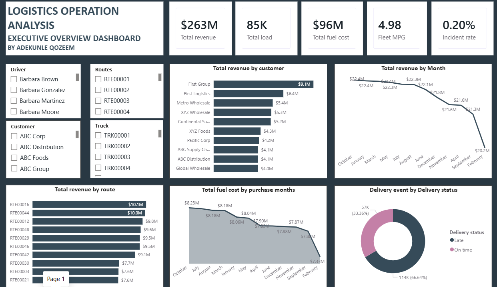
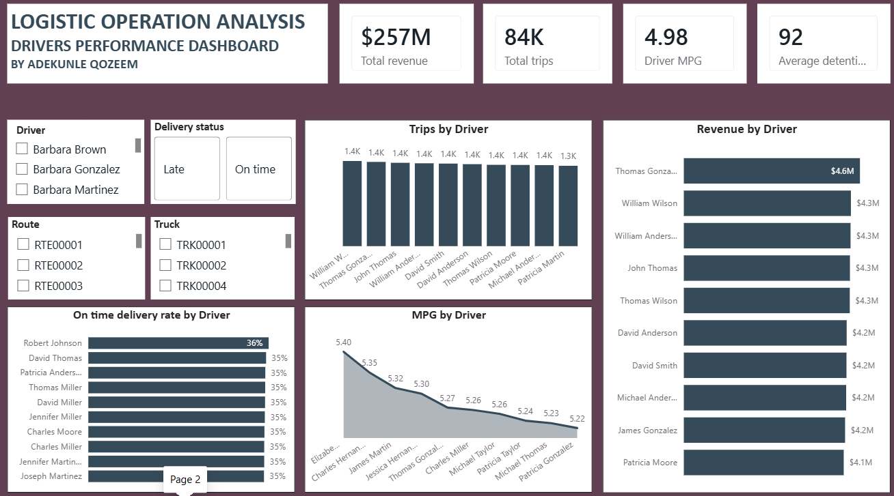
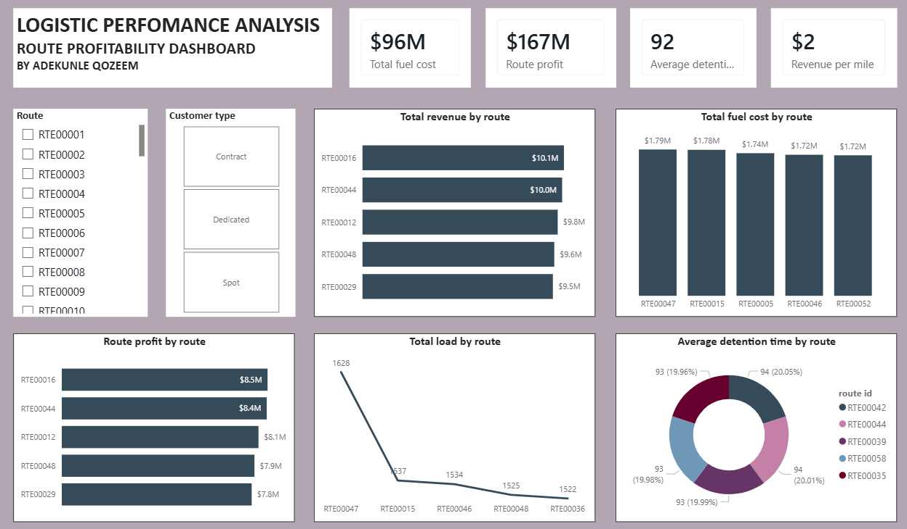
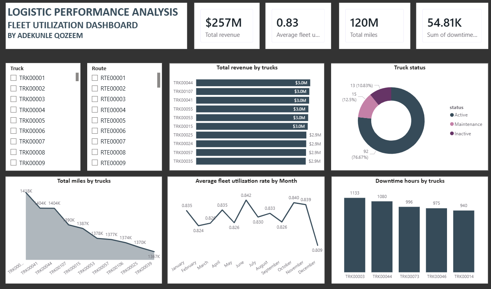
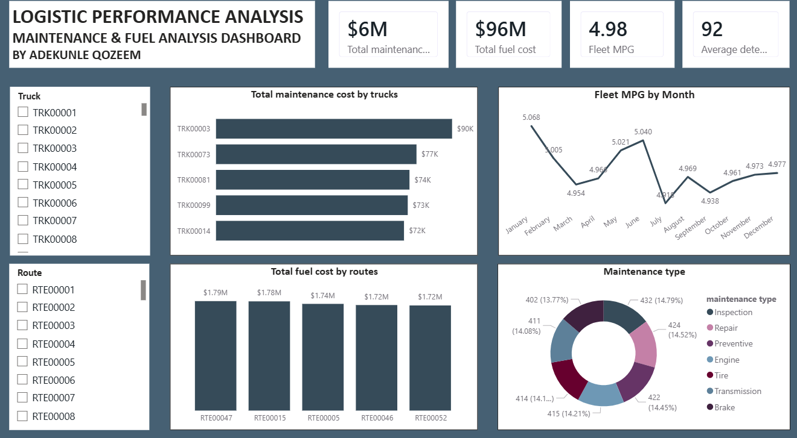
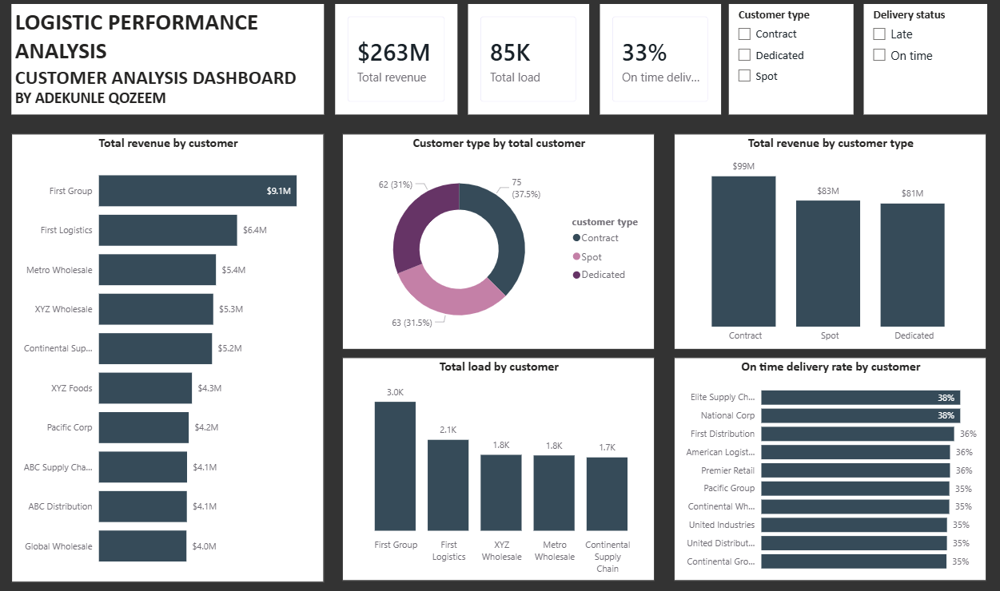
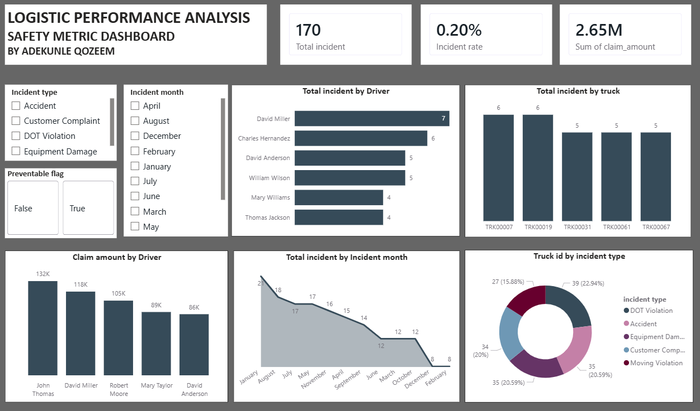
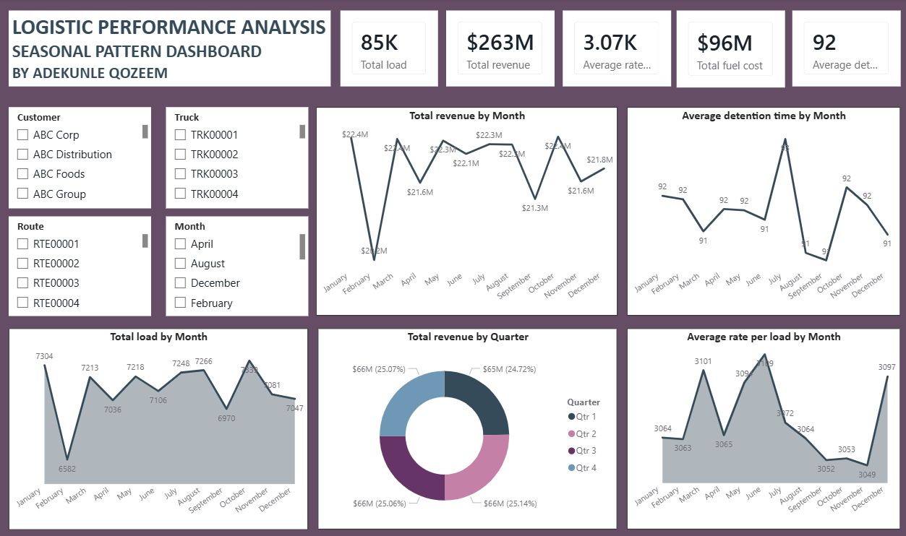
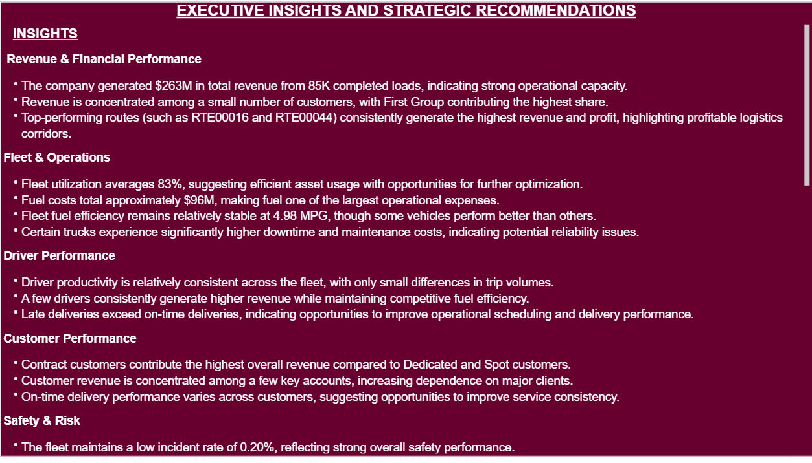
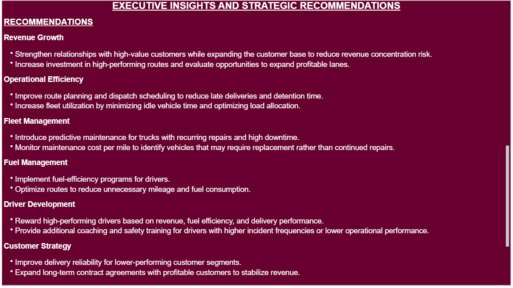

# Qozeem Adekunle | Data Analytics Portfolio

Power BI • Microsoft Excel • Business Intelligence • Data Visualization

# 🚛 Logistics Operations Analytics Dashboard

Power BI | DAX | Power Query | Microsoft Excel

A comprehensive Business Intelligence solution built in **Power BI** to analyze logistics operations, fleet performance, driver productivity, customer performance, safety metrics, and operational profitability.

This project transforms raw logistics data into actionable business insights through interactive dashboards, KPI monitoring, trend analysis, and executive recommendations.

---

# 📌 Project Overview

Managing logistics operations requires monitoring multiple business functions simultaneously, including drivers, routes, fleet utilization, maintenance, customer performance, and safety.

This Power BI solution provides executives with a centralized dashboard for tracking operational performance, identifying inefficiencies, and supporting data-driven decision-making.

---

# 🎯 Business Objectives

The dashboard was designed to answer key business questions such as:

- Which customers generate the highest revenue?
- Which routes are the most profitable?
- How efficiently is the fleet being utilized?
- Which drivers perform best?
- What factors contribute most to operational costs?
- How safe are fleet operations?
- What seasonal trends affect business performance?
- What strategic actions should management take?

---

# 📊 Dashboard Pages

## 1. Executive Overview Dashboard

Provides a high-level overview of company performance, including:

- Total Revenue
- Total Loads
- Fuel Cost
- Fleet MPG
- Incident Rate
- Revenue Trends
- Customer Revenue
- Delivery Status
- Route Performance

---

## 2. Driver Performance Dashboard

Analyzes driver productivity through:

- Revenue by Driver
- Trips by Driver
- MPG Performance
- On-Time Delivery Rate
- Driver Ranking
- Average Detention Time

---

## 3. Route Profitability Dashboard

Evaluates operational efficiency across logistics routes.

Key metrics include:

- Route Profit
- Revenue Per Mile
- Fuel Cost by Route
- Average Detention Time
- Total Revenue by Route

---

## 4. Fleet Utilization Dashboard

Monitors fleet performance using:

- Fleet Utilization Rate
- Truck Revenue
- Truck Status
- Downtime Hours
- Total Miles
- Monthly Utilization Trends

---

## 5. Maintenance & Fuel Analysis Dashboard

Tracks maintenance activities and operating costs.

Includes:

- Maintenance Cost by Truck
- Fuel Cost by Route
- Fleet MPG Trend
- Maintenance Type Distribution

---

## 6. Customer Analysis Dashboard

Provides customer intelligence through:

- Customer Revenue
- Customer Type
- Load Distribution
- On-Time Delivery Rate
- Revenue by Customer Category

---

## 7. Safety Metrics Dashboard

Measures fleet safety performance using:

- Incident Rate
- Claim Amount
- Incident Type
- Driver Incidents
- Truck Incidents
- Monthly Incident Trends

---

## 8. Seasonal Pattern Dashboard

Identifies seasonal business trends including:

- Monthly Revenue
- Quarterly Revenue
- Load Volume
- Detention Time
- Revenue Patterns

---

## 9. Executive Insights

Summarizes major business findings across the entire logistics operation.

Key insights include:

- Revenue performance
- Fleet utilization
- Driver productivity
- Customer performance
- Safety analysis
- Operational efficiency

---

## 10. Strategic Recommendations

Provides data-driven recommendations for management, including:

- Revenue growth strategies
- Fleet optimization
- Route optimization
- Predictive maintenance
- Driver development
- Customer retention
- Safety improvement initiatives

---

# 📈 Key KPIs

- Total Revenue
- Route Profit
- Revenue per Mile
- Fleet Utilization
- Fuel Cost
- Fleet MPG
- Average Detention Time
- Incident Rate
- On-Time Delivery Rate
- Customer Revenue
- Driver Revenue

---

# 🛠 Tools & Technologies

- Power BI
- Power Query
- DAX
- Microsoft Excel

---

# 📂 Dataset
The dashboard was built using a multi-table logistics dataset containing information on:

- Customers
- Drivers
- Trips
- Routes
- Deliveries
- Trucks
- Fleet Utilization
- Maintenance Records
- Fuel Purchases
- Safety Incidents
- Facilities
- Trailers
- Driver Monthly Metrics
- Loads

> **Dataset Notice**
> The original dataset is not included in this repository due to file size limitations and portfolio best practices.
> The complete Power BI dashboard, project documentation, and dashboard screenshots are provided.
> A sample dataset or additional project details can be shared upon reasonable request.
---

# 📊 Skills Demonstrated

- Data Cleaning
- Data Modeling
- Power Query (ETL)
- DAX Measures
- KPI Development
- Dashboard Design
- Data Visualization
- Business Intelligence
- Executive Reporting
- Data Storytelling

---

# 💡 Key Business Insights

- Generated over **$263M** in total revenue across **85K completed loads**.
- Revenue is concentrated among a small number of high-value customers.
- Top-performing routes consistently generate the highest revenue and profit.
- Fleet utilization averages approximately **83%**, indicating efficient asset usage.
- Fuel costs represent one of the largest operational expenses.
- Several trucks experience significantly higher maintenance costs and downtime.
- Late deliveries exceed on-time deliveries, highlighting opportunities to improve scheduling.
- Contract customers contribute the highest overall revenue.
- The fleet maintains a low incident rate of approximately **0.20%**, reflecting strong safety performance.

---

# 🚀 Strategic Recommendations

- Strengthen relationships with high-value customers while expanding the customer base.
- Invest further in high-performing routes.
- Optimize dispatch planning to improve delivery performance.
- Implement predictive maintenance for high-cost vehicles.
- Improve fuel efficiency through route optimization.
- Reward high-performing drivers.
- Increase preventive safety training.
- Continue monitoring operational KPIs through interactive dashboards.

---

# 👤 Author

**Qozeem Adekunle**

Data Analyst | Power BI | Microsoft Excel | Business Intelligence

- LinkedIn: *(https://www.linkedin.com/in/qozeem-adekunle-62560a3a9/)*
- GitHub: *(https://github.com/Qozeem-Adekunle)*

---

⭐ If you found this project interesting, feel free to star the repository.
